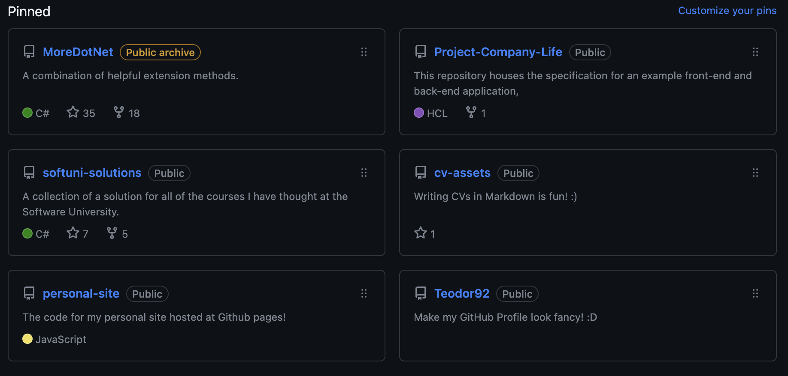
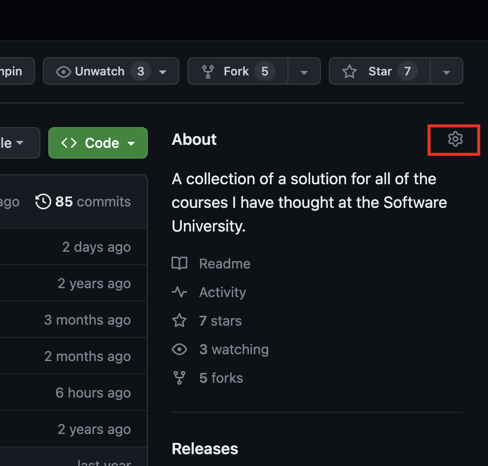

So you want to create an amazing GitHub profile? 🤔 Well, you've come to the right place! In this article, I will show you how to build a GitHub profile that will make you stand out from the crowd and get the most out of GitHub! Let's get started!

If you're in a hurry, here's the whole plan in seven steps:

1. Learn Markdown
2. Create open source software
3. Contribute to open source software
4. Fill in all of the relevant information
5. Showcase your best projects
6. Create a personal README
7. Follow repositories and people you find interesting

## What is GitHub?

GitHub is a website that allows you to host your code and collaborate with others. It's also a great place to showcase your work, which can be helpful when applying for jobs or internships. For many recruiters and fellow developers, your profile there is the first impression they get of you, so it's worth some care.

## Learning Markdown

The first thing you will need to do is learn Markdown. Markdown is a markup language that allows you to format text in a way that is easy for humans to read and write. It's also the language used all over GitHub, so it's important to learn how to use it. But don't worry! It's not as hard as it sounds. In fact, it's pretty easy once you get the hang of it.

Where to start? Just use the official [GitHub guide](https://docs.github.com/en/get-started/writing-on-github/getting-started-with-writing-and-formatting-on-github/basic-writing-and-formatting-syntax)!

## Create Open Source software

The best thing for your profile is to do some actual software contribution. But let's say that for now you don't have the time or the skills to do that. What can you do? The simplest thing would be to build some personal projects and host the code on GitHub. Doing a course in automation testing? Add the test suite that you've created to GitHub with an appropriate README. What is an appropriate README? Well, let's see. Here are some excellent examples:

- [An excellent template you can use on your project](https://github.com/othneildrew/Best-README-Template)
- [Great pointers about how to write a README](https://www.makeareadme.com/)
- [A ton of actual examples of great READMEs](https://github.com/matiassingers/awesome-readme)

At the end of the day you want your README to convey all the needed information, but also to be easy to read and understand. So, don't be afraid to use images, gifs, and other media to make it more appealing! And if you spend your coding hours in VS Code like me, my list of [17 useful VS Code extensions](/blog/useful-vscode-extensions/) might speed up the building part. 😄

## Contribute to Open Source software

Another great way to improve your profile is to contribute to open source software. This can be done in many ways, but the easiest is to find a project that you are interested in and start contributing. You can do this by fixing bugs, adding features, or even just writing documentation. If you're not sure where to start, [this guide](https://opensource.guide/how-to-contribute/) has some great tips on making your first open source contribution.

## Fill in all of the relevant information

You want to make sure that you have all of the relevant information on your profile. This includes your name, location, and contact information. You should also include a link to your resume or portfolio website if you have one (mine lives right here on this site's [CV page](/cv/)). If you don't have one yet, it's a good idea to create it so that potential employers can learn more about you and what you do. Include a link to your LinkedIn profile too. As for other social networks, it's up to you. I personally include them, but I don't think it's a must.

Additionally, work on a short description that you can use as a bio. This should be a short paragraph that describes who you are and what you do.

Moreover, choose an appropriate profile image: something that shows your face and is not too distracting. Avoid fitness selfies, drunk bar photos or anything of that sort. All in all, use common sense. If the picture is not something that you want to show your potential employer, don't use it. You want to look professional and approachable.

After you've included everything you should have something like this:

## Showcasing your Projects

Now that you have a great profile, don't forget to select the repositories that you are most proud of and pin them to your profile!

Here's a simple example of how the finished product might look:

Also, don't forget to add a description and tags to all of your repositories. This will help people understand what they are looking at and why it's important! You can do that from inside the repo itself:

## Creating a Personal README

A few years ago, GitHub introduced a new feature: the ability to create a README for your profile. This is a great way to showcase your work and let people know what you're all about. You can use this space to talk about yourself, your interests, and what you're working on, and include links to anything you want people to check out. It's the closest thing GitHub has to a personal homepage, so let your personality show. If you need more info about the feature, take a look at [GitHub's profile README docs](https://docs.github.com/en/account-and-profile/setting-up-and-managing-your-github-profile/customizing-your-profile/managing-your-profile-readme).

Let's explore some awesome tools that generate amazing personal READMEs:

- [GitHub Profile README Generator](https://rahuldkjain.github.io/gh-profile-readme-generator/)
- [GPRM, another great README generator](https://gprm.itsvg.in/)

Also, take a look at [this video](https://www.youtube.com/watch?v=n6d4KHSKqGk) for even more ideas.

Or you can just do it from scratch! Be creative, have fun and show your personality!

## Follow repositories and people that you are interested in

Following the repositories and people you find interesting keeps your feed alive and helps you stay current with the parts of software development you care about. It's also a quiet way to find new projects to work on and people to collaborate with. Not sure where to start? Try the projects you already use every day.

For example, you can follow the [React repository](https://github.com/facebook/react) if you are interested in React development, or the [Selenium repository](https://github.com/SeleniumHQ/selenium) if test automation is your thing.

## Bonus Tip: Creating a Portfolio Website

Do you want to go a step further? Why not create a personal website that can host your CV? Or portfolio? Blog? Or why not everything?

This is very easily achievable using GitHub Pages, and hosting is free. The only thing you might want to pay for is a domain name, which can cost as little as $10 per year. I personally use [Namecheap](https://www.namecheap.com/) for all of my domains.

**Update (August 2026):** when I first wrote this, this very site ran on Jekyll with the Minimal Mistakes theme, and that's what I recommended here. I've since rebuilt it from scratch with Astro (with an AI agent doing the heavy lifting). [Here's the full story](/blog/rebuilding-my-site-with-an-ai-agent/) if you're curious. The GitHub Pages advice still stands either way!

## Conclusion

Creating an amazing GitHub profile is not as hard as it sounds. It just takes some time and effort to make sure that all of the relevant information is in place. Work through the seven steps above and you'll have a profile that opens doors. Good luck! 🍀
