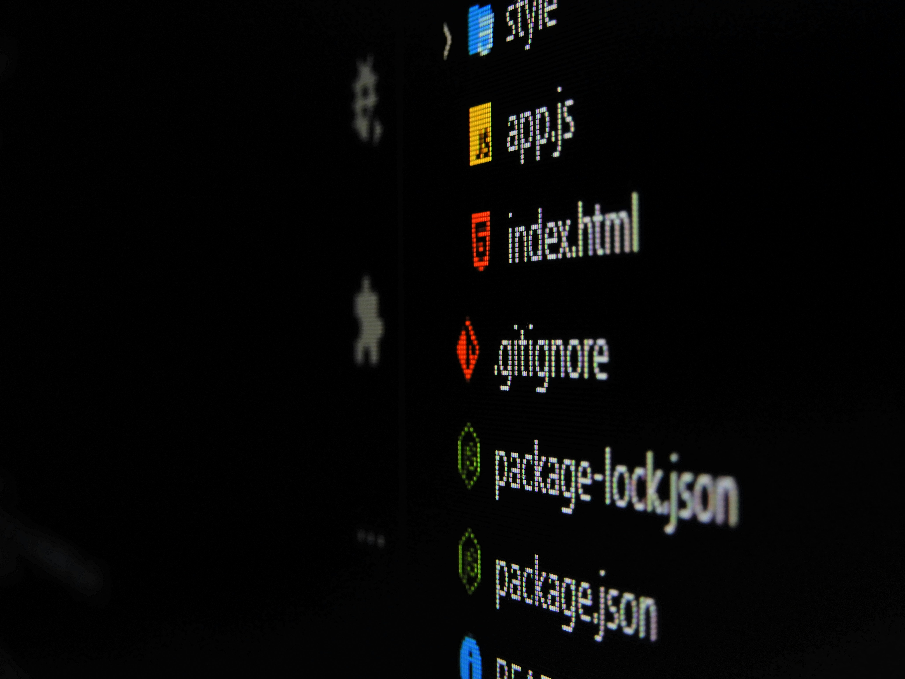

This is a list of 17 useful VSCode extensions that I use on a daily basis! 😄 They're in no particular order, so give the whole list a scan. Here's the quick reference:

| Extension                 | What it does                                 |
| ------------------------- | -------------------------------------------- |
| EmojiSense                | Emoji autocomplete while writing             |
| Code Spell Checker        | Catches typos in code and docs               |
| CodeSnap                  | Pretty screenshots of your code              |
| EditorConfig for VS Code  | Consistent editor settings per project       |
| Git History               | Browse the history of your repo              |
| gitignore                 | Generates .gitignore files per language      |
| GitLens                   | Supercharged Git inside the editor           |
| Path Intellisense         | Autocompletes file paths                     |
| Peacock                   | Color-codes your workspaces                  |
| TODO Highlight            | Highlights TODO/FIXME in code                |
| TODO Tree                 | All your TODOs in one tree view              |
| Trailing Spaces           | Shows and removes trailing whitespace        |
| Version Lens              | Shows if dependencies are up to date         |
| vscode-pdf                | Read PDFs inside VSCode                      |
| WSL                       | VSCode inside Windows Subsystem for Linux    |
| XML Tools                 | XML editing and formatting                   |
| YAML                      | YAML language support                        |

## 1. EmojiSense

[EmojiSense](https://marketplace.visualstudio.com/items?itemName=bierner.emojisense) is a great extension that allows you to use emojis while you write documents or articles! Example: 😄

## 2. Code Spell Checker

[Code Spell Checker](https://marketplace.visualstudio.com/items?itemName=streetsidesoftware.code-spell-checker) checks your spelling while you write docs, articles, code or anything else! It's a great tool if you constantly make typos like me! 😅

## 3. CodeSnap

Need some fancy screenshots of your code? [CodeSnap](https://marketplace.visualstudio.com/items?itemName=adpyke.codesnap) lets you take beautiful shots of any snippet and share them with others!

## 4. EditorConfig for VS Code

[EditorConfig for VS Code](https://marketplace.visualstudio.com/items?itemName=EditorConfig.EditorConfig) applies the same editor settings to every project automatically, so you don't have to do it manually. Don't know what an `.editorconfig` file is? Check out [the EditorConfig docs](https://editorconfig.org/)!

## 5. Git History

Want to see who broke the last build? [Git History](https://marketplace.visualstudio.com/items?itemName=donjayamanne.githistory) has you covered! It shows the history of your project and who changed what.

## 6. gitignore

[gitignore](https://marketplace.visualstudio.com/items?itemName=codezombiech.gitignore) generates a `.gitignore` file for your project based on the language you are using, so you never have to write one by hand again.

## 7. GitLens

[GitLens](https://marketplace.visualstudio.com/items?itemName=eamodio.gitlens) adds a ton of features to VSCode's Git capabilities: who made what changes, when, and why, right in the editor. Of everything on this list, this is the one I'd install first.

## 8. Path Intellisense

[Path Intellisense](https://marketplace.visualstudio.com/items?itemName=christian-kohler.path-intellisense) autocompletes paths to files as you type. Small thing, saves you all day long.

## 9. Peacock

Using multiple workspaces and need to tell them apart at a glance? [Peacock](https://marketplace.visualstudio.com/items?itemName=johnpapa.vscode-peacock) colors each workspace differently. Not sure what a workspace is? Check out [VS Code's workspace docs](https://code.visualstudio.com/docs/editor/workspaces)!

## 10. TODO Highlight

[TODO Highlight](https://marketplace.visualstudio.com/items?itemName=wayou.vscode-todo-highlight) makes your TODOs, FIXMEs and friends impossible to miss by highlighting them in the code.

## 11. TODO Tree

[TODO Tree](https://marketplace.visualstudio.com/items?itemName=Gruntfuggly.todo-tree) collects every TODO across your whole project into a single tree view. Pairs perfectly with TODO Highlight!

## 12. Trailing Spaces

[Trailing Spaces](https://marketplace.visualstudio.com/items?itemName=shardulm94.trailing-spaces) shows unnecessary trailing whitespace and removes it in one command.

## 13. Version Lens

[Version Lens](https://marketplace.visualstudio.com/items?itemName=pflannery.vscode-versionlens) shows whether your dependencies are up to date, right inside `package.json`, and lets you update them in place.

## 14. vscode-pdf

Want to read PDFs without leaving the editor? [vscode-pdf](https://marketplace.visualstudio.com/items?itemName=tomoki1207.pdf) does exactly that!

## 15. WSL

[WSL](https://marketplace.visualstudio.com/items?itemName=ms-vscode-remote.remote-wsl) lets you use VSCode with the Windows Subsystem for Linux. New to WSL? Check out [Microsoft's WSL overview](https://learn.microsoft.com/en-us/windows/wsl/about)!

## 16. XML Tools

Need to edit XML files? [XML Tools](https://marketplace.visualstudio.com/items?itemName=DotJoshJohnson.xml) is what you are looking for.

## 17. YAML

And what about YML? [YAML](https://marketplace.visualstudio.com/items?itemName=redhat.vscode-yaml) has you covered!

## Conclusion

These are the extensions I use on a daily basis! I hope you found some of them useful! 😄 They're all part of my day-to-day setup, which you can see in full on my [uses page](/uses/). And if you're polishing your developer presence beyond the editor, my guide to [creating an amazing GitHub profile](/blog/creating-an-amasing-github-profile/) pairs well with this list.
